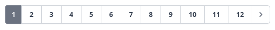

This package provides ready to use pagination components using tailwindcss, with multiple theme according to your taste. 


For example ***instead of*** :
```php
{{ $users->links() }}
```

You may use :
```html
<x-paginate :elems="$users" />
```

And it previews with ***default*** theme :


But you can **change** **themes** and more **settings** read [Usage](#usage).

<br/>


- **[Installation](#installation)**
- **[Usage](#usage)**
- **[Themes](#themes)**


## Prerequisites

**Tailwindcss** installed, **Laravel 8**, **PHP 8** 


## Installation

```bash
composer require amir-hossein5/laravel-components
```

```bash
php artisan laravel-components:install
```

And you may run ```npm run watch``` or, ```npm run dev``` or, ```npm run prod```

Be sure that **tailwindcss** has been added to page.

## Usage

- ### Pagination

For pagination use ```<x-paginate />``` tag with ```:elems=""``` to pass pagination items.

All parameters for paginate tag that you may use :


| parameter                             | description                                                         | default                          |
|-------------------------------------- |-------------------------------------------------------------------- | ---------------------------------|
| :elems=""                             |  pagination items                                                   |                                  |
| theme="string"                        |  name of theme. find themes [here](#themes)                         | [tailwind-light](#tailwind-light)| 
| prev="string"                         |  previous button's html                                             | laravel's default                |
| next="string"                         |  next button's html                                                 | laravel's default                |
| prevInResponsive="string"             |  previous button's html in responsive pagination                    | laravel's default                |
| nextInResponsive="string"             |  next button's html in responsive pagination                        | laravel's default                |
| :showDisabledButtons="boolean"        |  show disabled buttons when paginator is on first or last page      | depends on theme                 |
| :showPaginatorDetails="boolean"       | show text "Showing 4 to 6 of 12 results" or not                     | true                             |
| class="string"                        |  class for pagination main (parent) tag                             |                                  |


for example:

```html
<x-paginate
  :elems="$users"
  theme="tailwind-gray-circled"
  :showPaginatorDetails="false"
  :showDisabledButtons="true" 
/>
```


## Themes

- ### pagination

  - ### tailwind-light

    


  - ### tailwind-gray

    |                                 |                                   |
    | --------------------------------| --------------------------------- |
    |  |  |


  - ### tailwind-light-circled


    


  - ### tailwind-gray-circled

    
    
  

  - ### tailwind-light-underlined


    


  - ### tailwind-red-pill


    


<br/>

## Modification

You can modify components which located in **resources/vendor/pagination**.

## License

[License](LICENSE)
